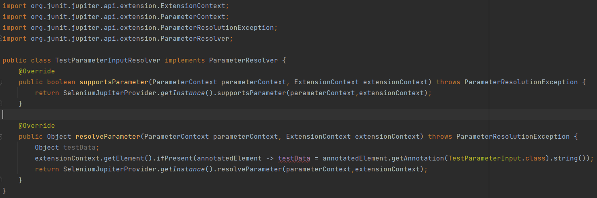

# Nezonium
A Gherkin-like wrapper framework for Selenium Automation Testing.

<h1>Extendable Framework:</h1>
Nezonium is built upon Selenium-Jupiter. Nezonium aims to abstract web testing nuances into a simply, legible expression.   

Nezonium defines many common browsers for you, such as: Chrome, Edge, Safari, and Firefox, just to name a few. Nezonium.

Nezonium leverages JUNIT5. So, developers needn't worry about driver dependency management. Should developers wish to add a currently, non-standard supported, WebDriver; developers simply can set/adjust the runtime WebDriverManager.

Nezonium leverages JUNIT5. At its core, it is a Parameterized Test. Users needn't worry about cross-bootstrap conflicts. Any JUNIT5 and Selenium cross-transient dependent frameworks will not compete. And, your API remains open for extension.

